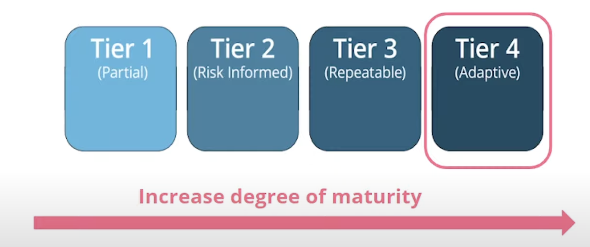
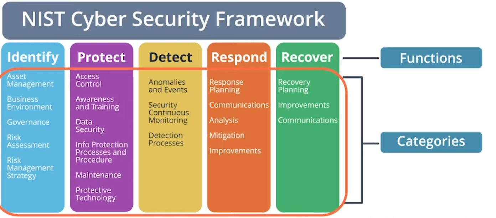
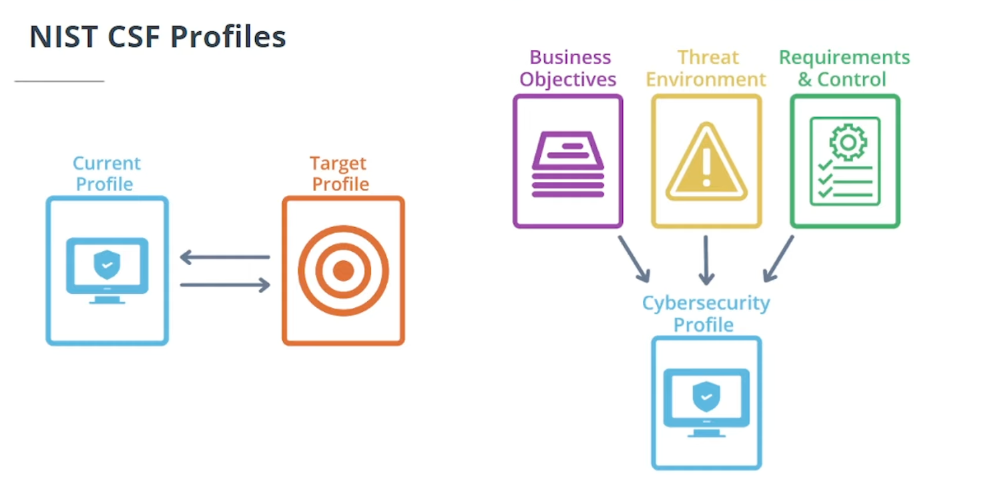

## NIST Cybersecurity Framework

In order to facilitate and create guidelines for developing and implementing cybersecurity programs in any type or organization, the NIST build the Cybersecurity Framework or NIST CSF.

This framework needs to be follow by any federal or government organization, but its also used by a lot of non-government organization to be compliant with the industry standards and reduce the risks of a security violation or data breach.

The **NIST CSF** helps organization to:

- Identify
- Manage, and
- Assess

their cyber risks.

It has three main parts:

- Core | An easy-to-understand set of cybersecurity goals
- Implementation tiers | How an organization manages risks
- Profiles | List of an organization requirements, objectives, risk tolerance and resources

#### NIST CSF Implementation Tiers

Depending on every organization maturity and level, it will need to implement one of the different implementation tiers that the Framework offers.

_More mature means less effort and time and greater protection_

#### NIST CSF Core

Helps to create and implement an cybersecurity program, and consists of three parts:

1. Functions
2. Categories
3. Subcategories

Where the Core have 5 functions and inside each one fit some categories to give direction on security controls and management.

#### NIST CSF Profiles

Those are the road map for the security program that needs to be implemented, forming the company unique alignment of business objectives, risks and requirements. By comparing the current profile with a target profile, the company can identify the area to improve the cybersecurity.
