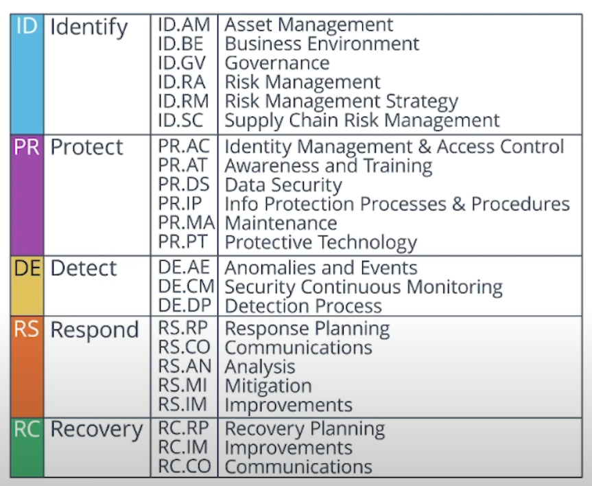

## NIST CSF Core

The NIST CSF Core its composed by functions and categories, where **Functions** are high level instructions on how to apply security throughout a program

#### Functions:

1. **Identify**
   Identify valuable access that are worth protecting
2. **Protect**
   Protect valuable assets from threats, and know what are you gonna do to protect those assets
3. **Detect**
   Know when something bad is happening
4. **Respond**
   What do you do when you detect a problem
5. **Recovery**
   How to quickly get back to business

Inside each function fit **Categories**, that are cybersecurity activities and outcomes organized into 23 different areas to implement and create you cybersecurity program

---

Further research:

- NIST CSF, "An Introduction to the Components of the Framework" - https://www.nist.gov/cyberframework/online-learning/components-framework
- NIST CSF Five Functions - https://www.nist.gov/cyberframework/online-learning/five-functions
