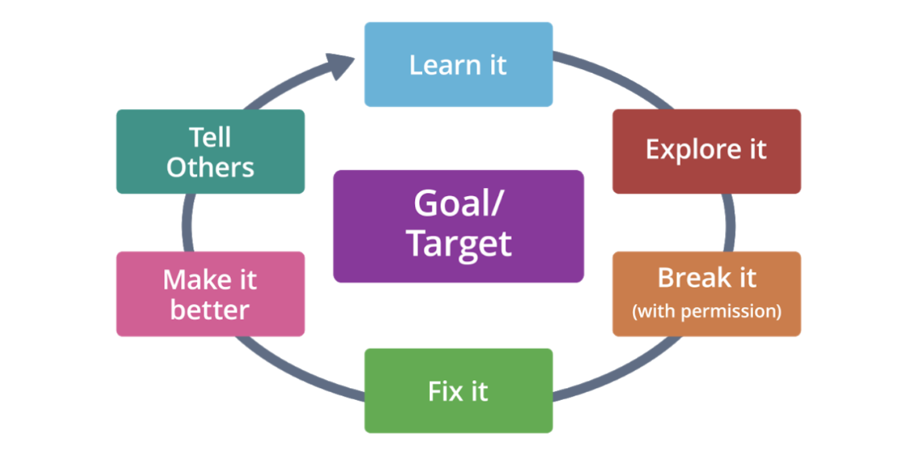

## Hacking Lifecycle

Hackers don't attack systems randomly, they use a specific life cycle or process to meet their goals.

#### Steps

1. **Goal**. Define the goal, system or device to attack.
2. **Learn it**. Learn as much as you can about the target -_Hackers don't work from ignorance_.
3. **Explore it**. Explore from all perspectives, understand how it works and recognize its parts.
4. **Break it**. Here you understand the targets, weaknesses or vulnerabilities.
5. **Fix it**. If you break something in the previous stage, fix it. Secure systems, devices, applications and networks from threats.
6. **Make it better**. Find the way to better secure the assets.
7. **Tell others**. Don't keep secrets, tell others what you find. _This is called Ethical Disclosure_.

##

### New terms

- Asset: A major application, general support system, high impact program, physical plant, mission-critical system, personnel, equipment, or a logically related group of systems.
- Vulnerability: Weakness in an information system, system security procedures, internal controls, or implementation that could be exploited or triggered by a threat
- Threat: Any circumstance or event with the potential to adversely impact organizational operations (including mission, functions, image, or reputation), organizational assets, individuals, other organizations, or the Nation through an information system via unauthorized access, destruction, disclosure, modification of information, and/or denial of service
- Risk: A measure of the extent to which an entity is threatened by a potential circumstance or event, and typically a function of: (i) the adverse impacts that would arise if the circumstance or event occurs; and (ii) the likelihood of occurrence
- Penetration Testing: A test methodology in which assessors, typically working under specific constraints, attempt to circumvent or defeat the security features of an information system.

Source: https://csrc.nist.gov/glossary/

### Further research

[The Jargon File](http://www.catb.org/jargon/html/index.html) contains a more thorough explanation of the hacking lifecycle including a comprehensive [glossary](http://www.catb.org/jargon/html/go01.html) of hacking terms.

If you enjoy history and want to learn more about original hackers, read How To Become A Hacker by Eric Steven Raymond found at http://www.catb.org/~esr/faqs/hacker-howto.html.

You can also read The Jargon File at http://www.catb.org/jargon/, which is "a comprehensive compendium of hacker slang illuminating many aspects of hackish tradition, folklore, and humor."
