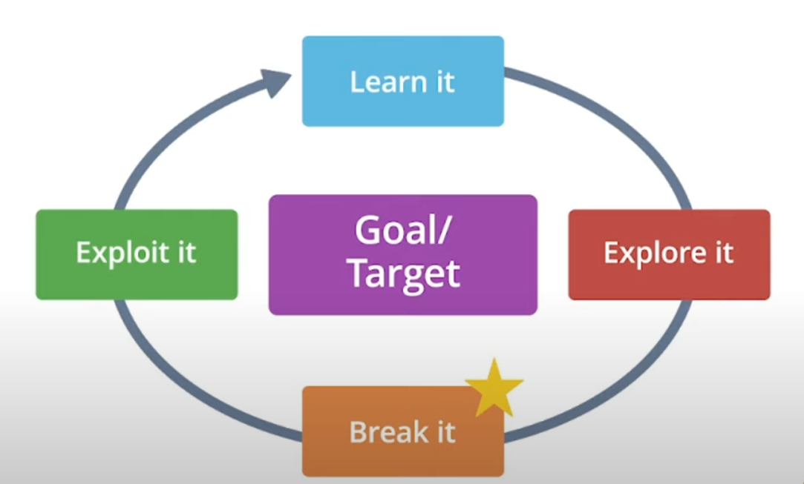

## Introduction to Threats, Attacks and Exploits

The NIST CSRC Glossary defines **threats** as:
Any circumstance or event with the potential to adversely impact organizational operations (including image or reputation), organizational assets, individuals, other organizations, or the Nation through an information system via unauthorized access, destruction, disclosure, modification of information, and/or denial of service.

So, its any event with the **potential** to cause damage, taking advantage of a **vulnerability** to **attack** one of more entities or systems.

#### Attack and exploit

In cybersecurity, the behavior of a threat trying to exploit or take advantage of a flaw in a computer system is an attack or exploit in action

Attack example:

- A malicious hacker who may try to crack a password database.
  Here the malicious hacker is the **Threat**, and cracking the password is the **Exploit** which is taking advantage from a serie of **Vulnerabilities** that give access.

Inside this concepts, there are some important definitions we need to know:

1. Threat source: is the person or thing likely to cause damage.
2. Threat vector: is the method or path a threat source will take to exploit a vulnerability or cause damage

#### Knowledge Base

[ATT&CK by MITRE](https://attack.mitre.org/) is a wellknown framework used to recover and discover attack scenarios that are saved here with the purpose to serve as a database for reference and guide.
