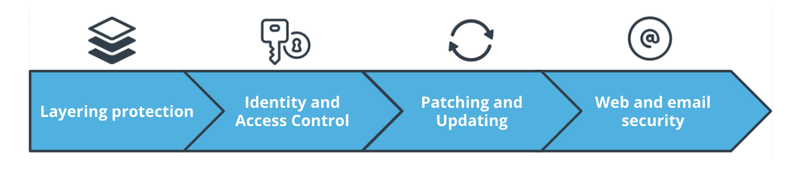

## Establishing Security Defenses

When is about establishing security defenses on computer systems. It’s the Protect function from the **NIST Cybersecurity Framework**. These defenses:

- Reduce the risk of data breaches and disclosure
- Prevent unauthorized access
- Minimize vulnerabilities by keeping your devices and applications updated
- Use email and the web safely

The more you can automate these activities and establish security procedures as part of your normal routine, the less chance you’ll need to respond to or recover from a security incident.

