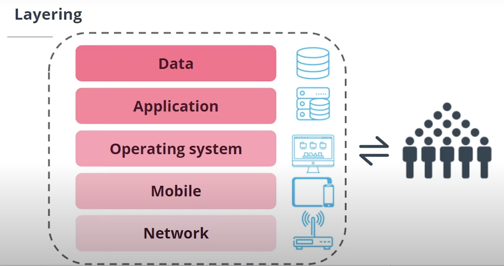

## Layering Protection

When we are searching to defend in depth, usually is about **providing multiple layers** in the different entities in our systems and organizations.

_Think like a castle with multiple protectionts and layers of security_

#### Layers of Defenses

In our systems and organizations, we have typically this above five layers that we need to protect and secure in order to establish high level security.

1. Networks
2. Mobile Devices
3. Operating Systems
4. Applications
5. Data _(sensitive information)_

We can't never forget that **all this layers are surrounding by HUMANS**.

#### Layering Protection

One example of applied layering protection is when a **user or employee access a database for client information**:

| Layering       | Protection                            |
| -------------- | ------------------------------------- |
| Data           | Encrypted Data                        |
| Database / App | Permissions, Firewall, Access Control |
| Op System      | Credentials                           |
| Network        | Local network or VPN                  |
