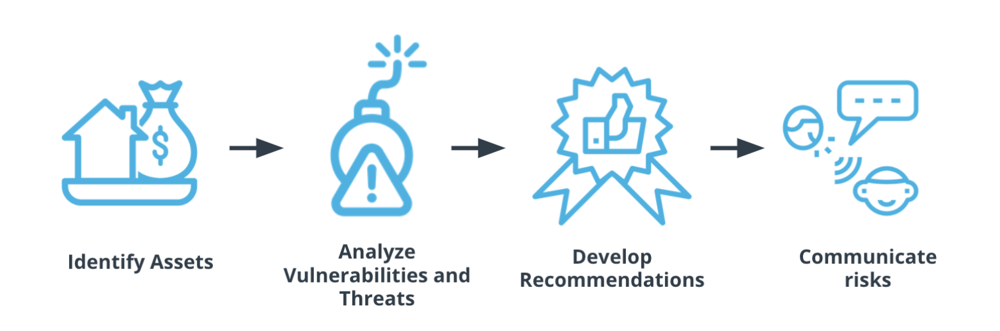

## Applying Cybersecurity: Big Picture

The application of cybersecurity principles follows a few steps.

- **Identifying assets.**Identify which users, machines, software, and networks belong to your organization.
- **Analyze vulnerabilities and threats.** You need to identify where an attack might arise, and how.
- **Recommend** how to secure and protect your organization’s assets based on your analysis.
- **Communicate** with others and convince them to adopt your recommendations to keep the organization safe.
