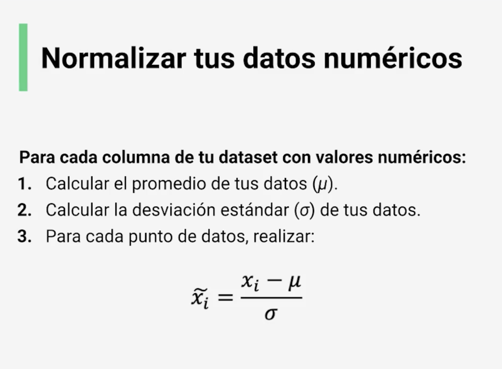
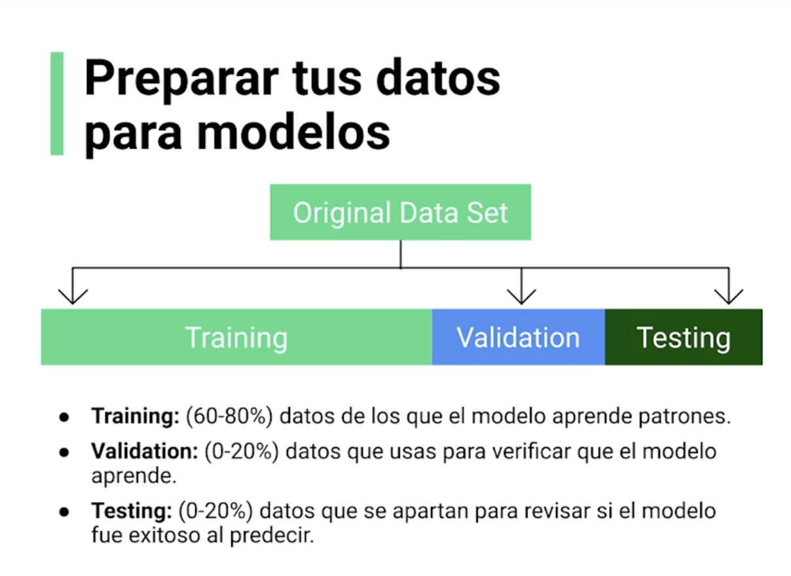

## The "Ingredients" for applying ML algorithms

#### The 3 basic steps

There is normally the nest 3 steps to follow in order to exeute and work with any ML algorithm:

1. **Decision Process.** How models will make a prediction using specific parameters.
2. **Error/Cost Function.** How to evaluate if the params in the model are making good predictions.
3. **Update Rule.** How to improve the parameters to make better predictions.

#### Normalize the numeric data

For every column in the dataset:

1. Calculate the average of the data (Y)
2. Calculate standard deviation of the data (P)
3. For every group of data, perform:

```
    XiT = Xi - Y / P
```



#### Prepare Numeric Data


