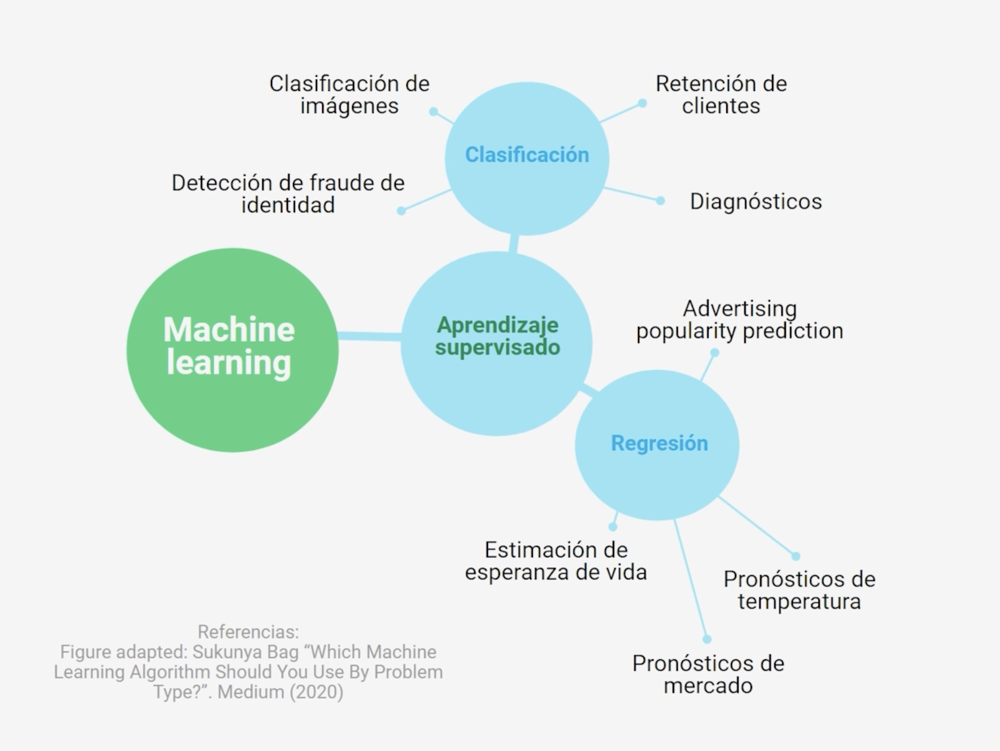
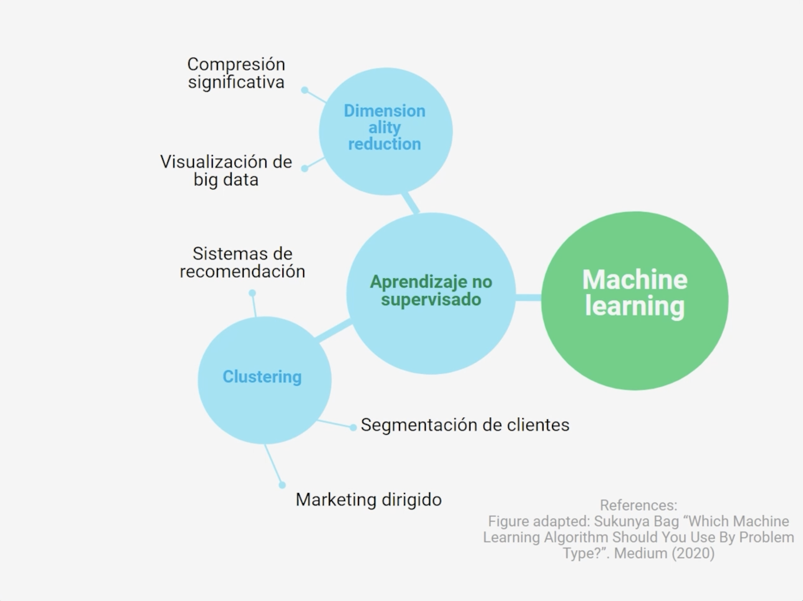
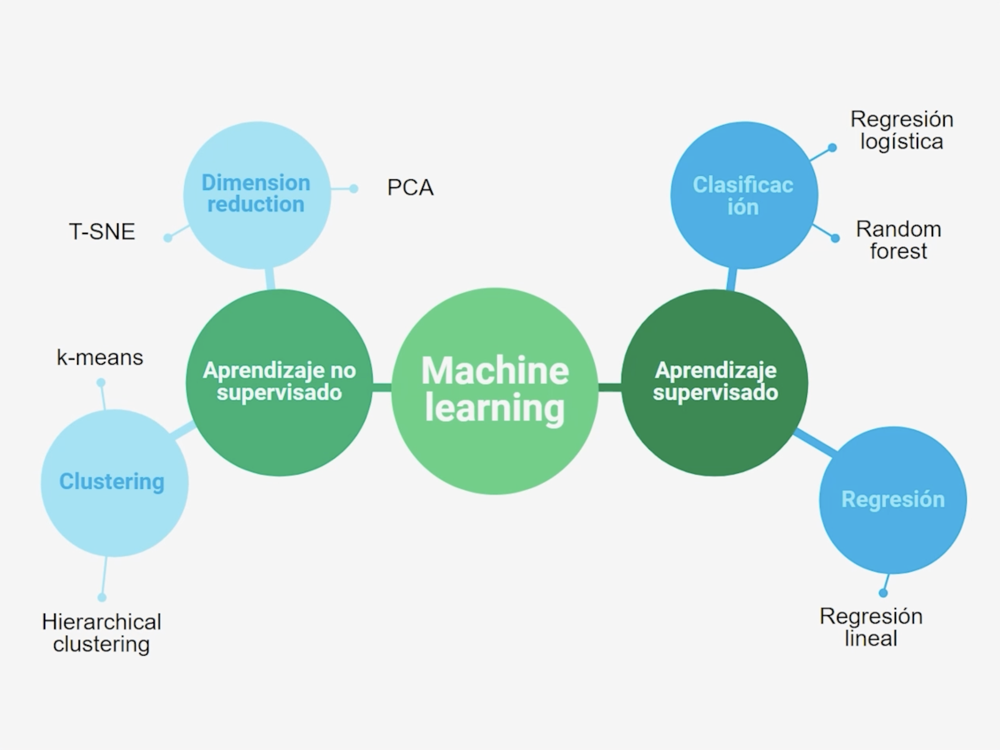

## Types of Models in Machine Learning

There are two main types:

1. **Supervised learning**
   In here, the model obtain features as input and always return one output, with a target/objetive to predict.
   - Regression
     The target output is numerical
   - Clasification
     The target output is a tag

2. **Unsupervised learning**
   When we deal with unknown objetives, and we want to find groups or structures inside our dataset

   - Clustering
     We want to find groups inside the data
   - Dimensionality Reduction
     Want to know which input features are important or useful in our data

#### Specific Algorithms used in every case

#### Summary

In ML generally we can use two approaches to learn and find patterns depending in the case: **Supervised algorithms** and **Unsupervised**

Supervised algorithms predict and target or objective, can be regression or classification

Unsupervised algorithms helps us to find groups and structures in our data, can be clustering or dimensionality reduction.
