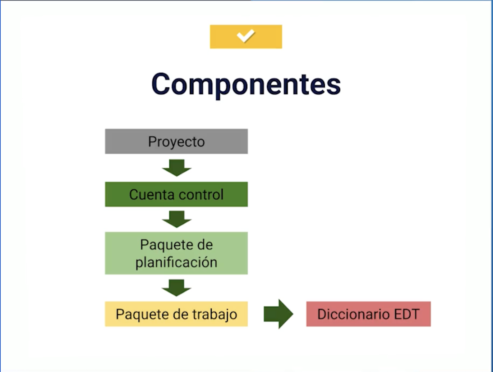
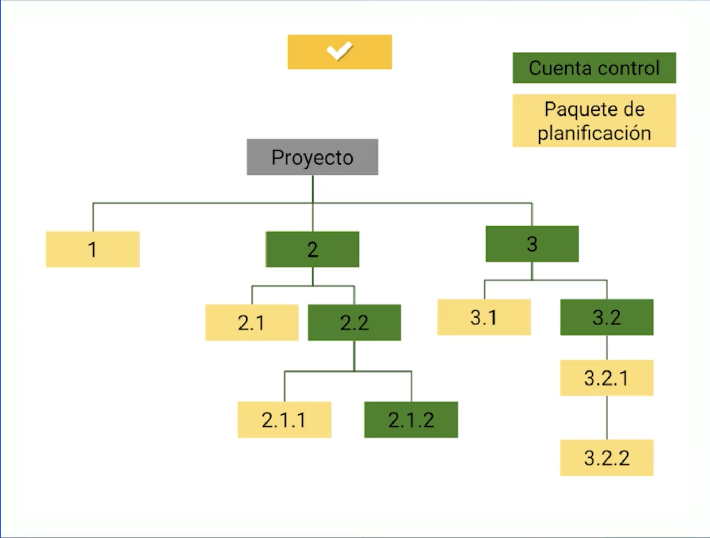
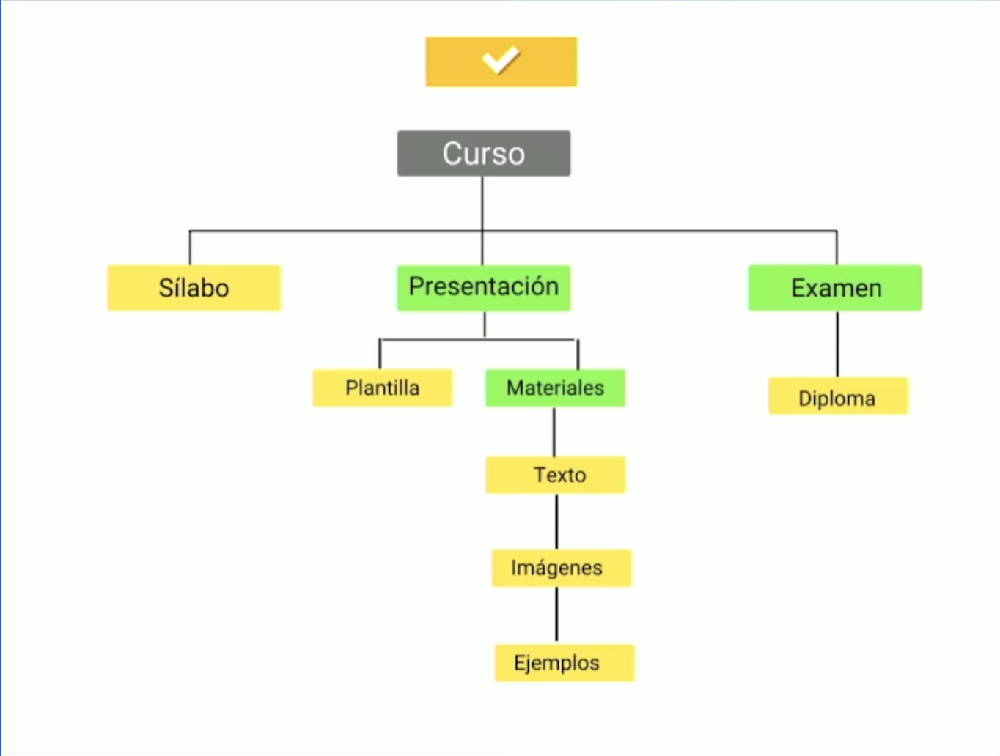

## Estructura de Desglose del Trabajo

La Estructura de Desglose del Trabajo o EDT, es una descomposición jerarquica orientada al entregable del proyecto, la cual tiene como finalidad detallar las tareas que seran ejecutadas por el equipo de trabajo para cumplir los objetivos y los productos entragables requeridos.

Nos ayuda a:

1. Respetar los tiempos
2. Tener control sobre los ciclos
3. Reducir riesgos

Al hablar de **Descomposición**, que es en lo que esta basada la EDT, nos referimos a tomar una tarea compleja y reducir a tareas pequeñas que la componen.

### Componentes

#### Desglose

#### Ejemplo

